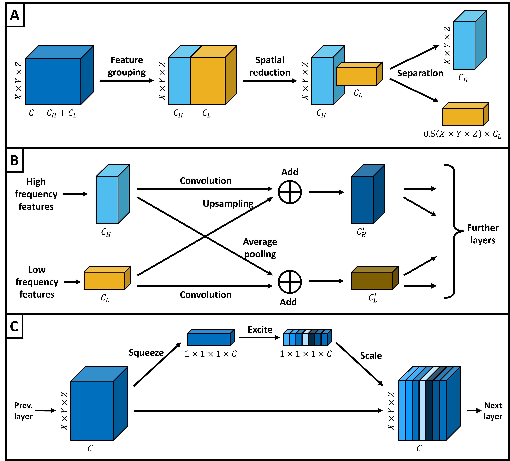
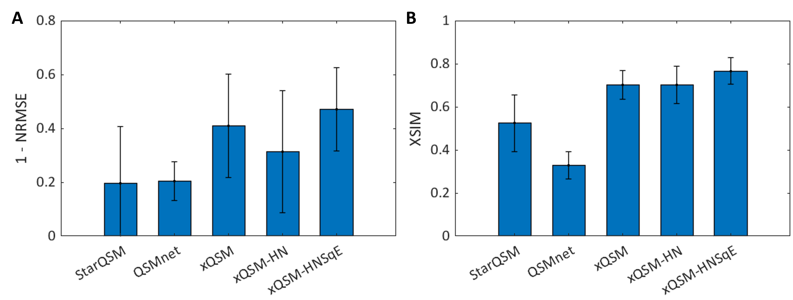
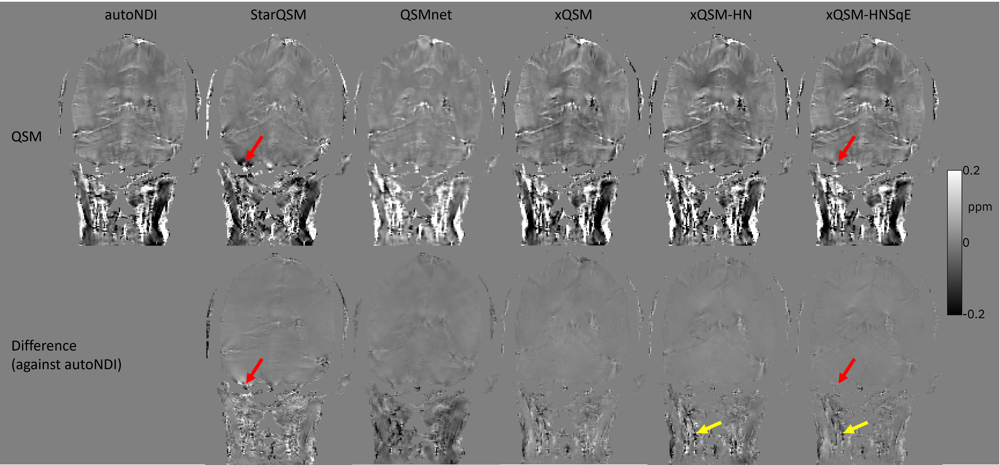

# SE-xQSM-Head-Neck

**Deep Learning QSM using xQSM with Squeeze-and-Excitation Networks in the Head and Neck**

This repository contains the implementation of the **SqE-HN** model, a deep learning approach for Quantitative Susceptibility Mapping (QSM) in the head and neck (HN) region. This work addresses the challenges of single-orientation QSM reconstruction in areas with significant air-tissue interfaces and fat-water phase artifacts.

---

## Project Overview

Traditional deep learning QSM methods often rely on multi-orientation training data (COSMOS), which is difficult to acquire outside the brain, i.e. in the head and neck.

To overcome this, we introduce **xQSM-HNSqE**, a deep learning architecture that leverages transfer learning to adapt brain-trained networks for head and neck (HN) applications. By refining the model architecture, we  improve QSM reconstruction quality, reduce artifacts, and enhance tissue contrast in single-orientation data.

**Key features of this approach include:**
* **Transfer Learning:** Adapting robust, brain-trained models to the unique anatomical challenges of the head and neck.
* **Octave Convolutions:** Processing high- and low-spatial frequency information in parallel to improve computational efficiency and maintain structural integrity.
* **Squeeze-and-Excitation (SE) Blocks:** Adaptively weighting feature channels based on global context, which we found crucial for mitigating background field artifacts and reducing noise near air-tissue interfaces.

### 

**Figure 1**: Schematic representation of DL modules used in xQSM-HNSqE. (A) Octave feature representation6 where spatial features are separated into high- and low-frequency channels, with low-frequency channels down-sampled in space. (B) Octave convolution,6, in which information from both high- and low-frequency streams is integrated at each convolutional layer. (C) Squeeze-and-excitation block,8 in which feature channels are weighted based on their global average.

## Project Results

### 

**Figure 2**: Error metrics for inferred QSMs compared against autoNDI ‘ground truth’ data, for the test dataset (N=7). (A) 1 - Normalized RMSE, such that higher values indicate smaller differences between inference and ground truth. (B) XSIM, where higher values indicate greater similarity.

### 

**Figure 3**: Example QSMs (coronal view) from one test dataset subject, for each QSM reconstruction method tested, and difference maps relative to autoNDI. In the neck: QSMnet tends to reduce contrast relative to other methods, and xQSM is saturated with extreme values, whereas tissues are more clearly distinguished in xQSM-HN and xQSM-HNSqE. Red arrows: QSM artefact present in StarQSM not present in xQSM versions. Yellow arrows: additional noise in xQSM-HN, which is not present in xQSM-HNSqE.

---

## Repository Structure

The repository is organized as follows:

* **`xQSM/`**: Main implementation directory.
    * **`python/`**: Core logic for the deep learning models.
        * **`training/`**: Scripts for transfer learning and training on HN data (e.g., `Train_NoFreeze_TL.py`).
        * **`eval/`**: Scripts for model inference and evaluation.
          * **`run_demo.ipynb`**: Use this notebook to run some demo processing on data. 
        * `Unet_blocks.py` / `xQSM_blocks.py`: Network architecture definitions including Octave Convolutions and SE blocks.
    * **`Pretrained_Checkpoints/`**: Directory for storing `.pth` model weights.
* **`DeepQSM/`**: Alternative/baseline model implementation for comparison.
* **`requirements.txt`**: List of Python dependencies required to run the models.

## Installation & Setup

### 1. Clone this Repository
```bash
git clone [https://github.com/Sergikavtaradze/SE-xQSM-Head-Neck.git](https://github.com/Sergikavtaradze/SE-xQSM-Head-Neck.git)
cd SE-xQSM-Head-Neck
```

Navigate inside the **`xQSM/`** folders to read specific README.md files for running inference, training the models or doing visualisations!

### 2. External Dependencies
The evaluation scripts in this repository require the FANSI Toolbox for iterative reconstruction logic and metric calculations.

Download FANSI: [GitLab Link](https://gitlab.com/cmilovic/FANSI-toolbox) to FANSI-toolbox

Setup: Download and add the FANSI folder to your MATLAB path:

```Matlab
addpath(genpath('/path/to/FANSI-toolbox'))
savepath
```
### 3. Software Requirements
Python 3.9.16: Required for model inference.

MATLAB: Required for running the similarity metric evaluation scripts.

## Evaluation Metrics
The similarity metrics (NRMSE, pSNR, and XSIM) are calculated using the scripts in the /evaluation folder. These scripts compare the DL-reconstructed QSM maps against the autoNDI iterative ground truth.

Note: Ensure your data is pre-processed using the standard HN QSM pipeline (Phase unwrapping via SEGUE, background field removal via PDF) before running the evaluation.

## Citation & References

If you find this work useful in your research, please cite:

1. **Kavtaradze, S., Shmueli, K., Cherukara, M. T.** "Deep Learning QSM using xQSM with Squeeze-and-Excitation Networks in the Head and Neck." *ISMRM 2026*, Abstract #560-02-005.
2. **Bilgic, B., Chatnuntawech, I., Langkammer, C., Setsompop, K.** "Sparse Methods for Quantitative Susceptibility Mapping." *Wavelets and Sparsity XVI, SPIE*, 2015.
3. **Milovic, C., Bilgic, B., Zhao, B., Acosta-Cabronero, J., Tejos, C.** "Fast Nonlinear Susceptibility Inversion with Variational Regularization." *Magn Reson Med.*, 2018. [DOI: 10.1002/mrm.27073](https://doi.org/10.1002/mrm.27073)

For questions or collaboration, please contact us at matthew.cherukara@kcl.ac.uk and sergi.kavtaradze.20@ucl.ac.uk or refer to the poster presented at ISMRM 2026.